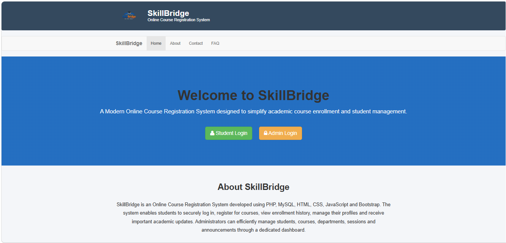
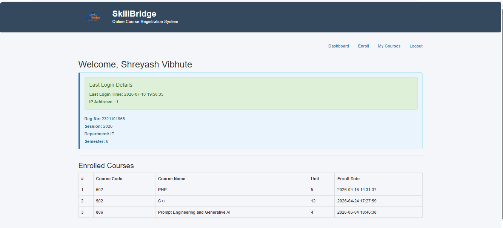
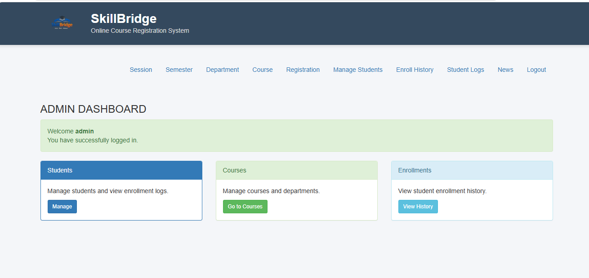

# 🎓 SkillBridge - Online Course Registration System


## 📖 Project Overview

SkillBridge is a web-based Online Course Registration System developed using PHP, MySQL, HTML, CSS, JavaScript, and Bootstrap.

The application provides a secure platform where students can register, log in, manage their profiles, enroll in courses, and track enrollment history. Administrators can efficiently manage students, departments, semesters, sessions, courses, and news through a dedicated admin dashboard.

This project was developed as a Major Project for the Bachelor of Computer Applications (BCA) program and demonstrates practical implementation of authentication, database management, CRUD operations, session handling, and role-based access control.

---

## ✨ Features

### Student Module

- Student Registration
- Secure Login Authentication
- Password Encryption
- Student Dashboard
- Profile Management
- Course Enrollment
- Enrollment History
- Change Password
- Printable Reports

### Admin Module

- Admin Login
- Dashboard Analytics
- Student Management
- Department Management
- Semester Management
- Session Management
- Course Management
- Enrollment Monitoring
- News Management
- User Login Logs

---

## 🛠 Technologies Used

- PHP
- MySQL
- HTML5
- CSS3
- JavaScript
- Bootstrap
- XAMPP
- Git
- GitHub

---

## 📷 Project Screenshots

### Home Page



---

### Student Login


---

### Student Dashboard



---

### Admin Dashboard



---

### Course Registration


---

## ⚙ Installation Guide

### Clone Repository

```bash
git clone https://github.com/shreyashv1965/SkillBridge.git
```

### Move Project

Copy the project inside:

```
xampp/htdocs/
```

### Import Database

Open phpMyAdmin

Create database:

```
onlinecourse
```

Import:

```
SQL File/onlinecourse.sql
```

### Start XAMPP

- Apache
- MySQL

### Run Project

```
http://localhost/SkillBridge
```

---

## 📂 Folder Structure

```
SkillBridge
│
├── admin
├── assets
├── includes
├── SQL File
├── studentphoto
├── screenshots
└── README.md
```

---

## 🚀 Future Enhancements

- Email Verification
- OTP Authentication
- Course Recommendation
- Attendance Management
- Online Payments
- REST API
- Mobile Responsive UI
- Cloud Deployment

---

## 👨‍💻 Developer

**Shreyash Vibhute**

Bachelor of Computer Applications

GitHub:
https://github.com/shreyashv1965

---

## 📄 License

This project is licensed under the MIT License.
